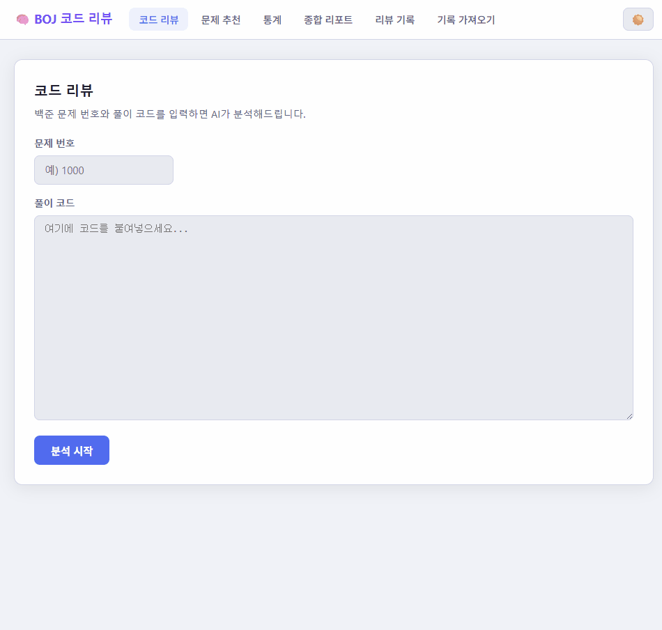

# BOJ / Codeforces 코드 리뷰 & 문제 추천

알고리즘 풀이 코드를 AI로 분석하고, 학습 기록을 바탕으로 약한 태그를 추적하는 웹앱입니다.

현재 지원 범위:
- `BOJ`: 코드 리뷰, 문제 추천, 통계, 제출 기록 import
- `Codeforces`: 코드 리뷰, 제출 기록 import



## 주요 기능

- 코드 리뷰
  - BOJ 또는 Codeforces 문제 번호와 코드를 입력하면 AI가 시간복잡도, 효율성, 개선점, 강점/약점을 분석합니다.
- 기록 import
  - `BaekjoonHub GitHub` 저장소 import
  - `BOJ 제출 기록` import
  - `Codeforces handle` 기반 import
- 리뷰 기록 조회
  - 문제별 제출 이력과 상세 피드백을 다시 확인할 수 있습니다.
- 통계 / 리포트
  - BOJ 기준 태그 통계, 티어 변화, 누적 분석 리포트를 제공합니다.
- 문제 추천
  - BOJ 기준 약한 태그와 난이도 범위를 바탕으로 다음 문제를 추천합니다.

## Codeforces 관련 주의사항

- Codeforces 문제 메타데이터는 공식 API로 가져옵니다.
- Codeforces 문제 본문(statement)은 공식 API가 제공하지 않으므로 자동 수집이 실패할 수 있습니다.
  - 이 경우 리뷰 화면의 `문제 설명` 입력칸에 직접 붙여 넣으면 더 정확하게 분석할 수 있습니다.
- Codeforces 제출 소스코드 import는 본인 계정 API Key / Secret이 있어야 제대로 동작합니다.
  - 없으면 기록만 가져오고, 코드가 없는 항목은 AI 리뷰를 바로 돌릴 수 없습니다.

## 로컬 실행

### 1. 요구사항

- Python 3.11+
- AI API 키

### 2. 설치

```bash
git clone https://github.com/SIDED00R/boj-code-review.git
cd boj-code-review

python -m venv venv

# Windows
.\venv\Scripts\activate

# macOS / Linux
source venv/bin/activate

pip install -r requirements.txt
```

### 3. 환경변수 설정

`.env.example`를 복사해서 `.env`를 만듭니다.

```bash
cp .env.example .env
```

예시:

```env
OPENAI_API_KEY=your_openai_key

# 선택: Codeforces 소스 코드 import
CODEFORCES_API_KEY=your_codeforces_key
CODEFORCES_API_SECRET=your_codeforces_secret

# 선택: PostgreSQL 사용 시
# DB_TYPE=postgres
# DB_NAME=boj_review
# DB_USER=boj_user
# DB_PASSWORD=your_password
# DB_HOST=localhost
# DB_PORT=5432
# DB_SOCKET=/cloudsql/PROJECT:REGION:INSTANCE
```

### 4. 실행

```bash
python -m uvicorn server:app --reload
```

브라우저에서:

- `http://127.0.0.1:8000`
- 또는 `http://localhost:8000`

## Codeforces API 발급

Codeforces API Key / Secret 발급 위치:

- `https://codeforces.com/settings/api`

사용 목적:

- `user.status(..., includeSources=true)` 호출
- 본인 계정의 제출 소스코드 import

## 배포

### Cloud Run + Cloud SQL

이 프로젝트는 GCP Cloud Run + Cloud SQL(PostgreSQL) 구성으로 배포할 수 있습니다.

필수 환경변수 예시:

```env
OPENAI_API_KEY=...
CODEFORCES_API_KEY=...
CODEFORCES_API_SECRET=...
DB_TYPE=postgres
DB_NAME=boj_review
DB_USER=boj_user
DB_PASSWORD=your_password
DB_SOCKET=/cloudsql/PROJECT:REGION:INSTANCE
```

Cloud Run 배포 시 Cloud SQL 연결도 함께 설정해야 합니다.

## 프로젝트 구조

```
.
├── server.py                  # FastAPI 앱 진입점 (라우터 등록만)
├── db.py                      # DB 초기화 / 쿼리
├── api_client.py              # 외부 API 클라이언트 (BOJ, Codeforces, OpenAI)
├── routes/
│   ├── models.py              # Pydantic 요청/응답 모델
│   ├── helpers.py             # 공유 헬퍼 (build_readme 등)
│   ├── auth.py                # GitHub OAuth
│   ├── review.py              # 코드 리뷰 & GitHub push
│   ├── problem.py             # CF 문제 조회 & 번역
│   ├── execute.py             # 코드 실행 (Python / C++)
│   ├── recommend.py           # 문제 추천
│   ├── history.py             # 리뷰 기록 조회
│   ├── solved.py              # import된 제출 기록 관리
│   ├── import_routes.py       # GitHub / BOJ / CF import
│   └── stats.py               # 통계 & 종합 리포트
└── static/
    ├── index.html
    ├── style.css
    └── js/
        ├── utils.js           # 공유 유틸 (tierClass, effLabel 등)
        ├── editor.js          # CodeMirror 에디터 초기화
        ├── theme.js           # 다크/라이트 모드
        ├── tabs.js            # 탭 전환
        ├── github.js          # GitHub 연결 UI
        ├── tier-chart.js      # 티어 변화 차트
        ├── review.js          # 코드 리뷰 탭
        ├── recommend.js       # 문제 추천 탭
        ├── problem-modal.js   # CF 문제 뷰어 모달
        ├── stats.js           # 풀이 통계 탭
        ├── history.js         # 리뷰 기록 탭
        ├── import.js          # 기록 import 탭
        └── report.js          # 종합 리포트 탭
```

> 각 파일은 단일 기능만 담당합니다 (Single Responsibility Principle).

## 기술 스택

- Backend: FastAPI + Uvicorn
- Frontend: HTML / CSS / Vanilla JS
- AI: OpenAI API
- BOJ 데이터: solved.ac API + 페이지 크롤링
- Codeforces 데이터: Codeforces API
- DB:
  - 로컬: SQLite
  - 배포: PostgreSQL

## 환경변수

- `OPENAI_API_KEY`
  - AI 리뷰용 OpenAI 키
- `CODEFORCES_API_KEY`
  - 선택, Codeforces 본인 제출 코드 import용
- `CODEFORCES_API_SECRET`
  - 선택, Codeforces 본인 제출 코드 import용
- `DB_TYPE`
  - `sqlite` 또는 `postgres`
- `DB_NAME`
  - PostgreSQL DB 이름
- `DB_USER`
  - PostgreSQL 사용자
- `DB_PASSWORD`
  - PostgreSQL 비밀번호
- `DB_HOST`
  - PostgreSQL 호스트
- `DB_PORT`
  - PostgreSQL 포트
- `DB_SOCKET`
  - Cloud SQL Unix socket 경로

## 라이선스

MIT
